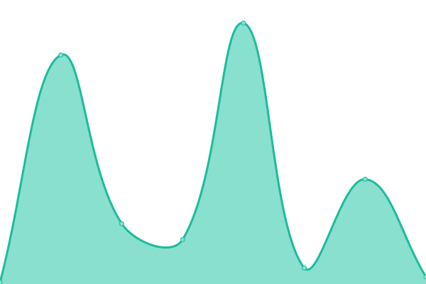

# [📈 Live Status](https://openupm.github.io/upptime): <!--live status--> **🟩 All systems operational**

This repository contains the open-source uptime monitor and status page for [OpenUPM](https://openupm.github.io/upptime), powered by [Upptime](https://github.com/upptime/upptime).

With [Upptime](https://upptime.js.org), you can get your own unlimited and free uptime monitor and status page, powered entirely by a GitHub repository. We use [Issues](https://github.com/openupm/upptime/issues) as incident reports, [Actions](https://github.com/openupm/upptime/actions) as uptime monitors, and [Pages](https://openupm.github.io/upptime) for the status page.

<!--start: status pages-->
<!-- This summary is generated by Upptime (https://github.com/upptime/upptime) -->
<!-- Do not edit this manually, your changes will be overwritten -->
<!-- prettier-ignore -->
| URL | Status | History | Response Time | Uptime |
| --- | ------ | ------- | ------------- | ------ |
|  [[Global] OpenUPM Website](https://openupm.com) | 🟩 Up | [global-open-upm-website.yml](https://github.com/openupm/upptime/commits/HEAD/history/global-open-upm-website.yml) | 

 93ms
     
 | 

<a href="https://openupm.github.io/upptime/history/global-open-upm-website">100.00%</a>
    

|  [[Global] OpenUPM Website Docs](https://openupm.com/docs/) | 🟩 Up | [global-open-upm-website-docs.yml](https://github.com/openupm/upptime/commits/HEAD/history/global-open-upm-website-docs.yml) | 

 37ms
     
 | 

<a href="https://openupm.github.io/upptime/history/global-open-upm-website-docs">100.00%</a>
    

|  [[Global] OpenUPM Website Packages](https://openupm.com/packages/) | 🟩 Up | [global-open-upm-website-packages.yml](https://github.com/openupm/upptime/commits/HEAD/history/global-open-upm-website-packages.yml) | 

 32ms
     
 | 

<a href="https://openupm.github.io/upptime/history/global-open-upm-website-packages">100.00%</a>
    

|  [[Global] OpenUPM Website Package Detail](https://openupm.com/packages/com.littlebigfun.addressable-importer/) | 🟩 Up | [global-open-upm-website-package-detail.yml](https://github.com/openupm/upptime/commits/HEAD/history/global-open-upm-website-package-detail.yml) | 

 29ms
     
 | 

<a href="https://openupm.github.io/upptime/history/global-open-upm-website-package-detail">100.00%</a>
    

|  [[Global] OpenUPM API /site/info](https://api.openupm.com/site/info) | 🟩 Up | [global-open-upm-api-site-info.yml](https://github.com/openupm/upptime/commits/HEAD/history/global-open-upm-api-site-info.yml) | 

 301ms
     
 | 

<a href="https://openupm.github.io/upptime/history/global-open-upm-api-site-info">100.00%</a>
    

|  [[Global] OpenUPM API /packages/extra](https://api.openupm.com/packages/extra) | 🟩 Up | [global-open-upm-api-packages-extra.yml](https://github.com/openupm/upptime/commits/HEAD/history/global-open-upm-api-packages-extra.yml) | 

 315ms
     
 | 

<a href="https://openupm.github.io/upptime/history/global-open-upm-api-packages-extra">100.00%</a>
    

|  [[Global] OpenUPM API /packages/recent](https://api.openupm.com/packages/recent) | 🟩 Up | [global-open-upm-api-packages-recent.yml](https://github.com/openupm/upptime/commits/HEAD/history/global-open-upm-api-packages-recent.yml) | 

 63ms
     
 | 

<a href="https://openupm.github.io/upptime/history/global-open-upm-api-packages-recent">100.00%</a>
    

|  [[Global] OpenUPM API /feeds/updates/rss](https://api.openupm.com/feeds/updates/rss) | 🟩 Up | [global-open-upm-api-feeds-updates-rss.yml](https://github.com/openupm/upptime/commits/HEAD/history/global-open-upm-api-feeds-updates-rss.yml) | 

 64ms
     
 | 

<a href="https://openupm.github.io/upptime/history/global-open-upm-api-feeds-updates-rss">100.00%</a>
    

|  [[Global] OpenUPM API /packages/package-name](https://api.openupm.com/packages/com.littlebigfun.addressable-importer) | 🟩 Up | [global-open-upm-api-packages-package-name.yml](https://github.com/openupm/upptime/commits/HEAD/history/global-open-upm-api-packages-package-name.yml) | 

 67ms
     
 | 

<a href="https://openupm.github.io/upptime/history/global-open-upm-api-packages-package-name">100.00%</a>
    

|  [[Global] OpenUPM Registry /-/all](https://package.openupm.com/-/all) | 🟩 Up | [global-open-upm-registry-all.yml](https://github.com/openupm/upptime/commits/HEAD/history/global-open-upm-registry-all.yml) | 

 1685ms
     
 | 

<a href="https://openupm.github.io/upptime/history/global-open-upm-registry-all">100.00%</a>
    

|  [[Global] OpenUPM Registry /package-name](https://package.openupm.com/com.littlebigfun.addressable-importer) | 🟩 Up | [global-open-upm-registry-package-name.yml](https://github.com/openupm/upptime/commits/HEAD/history/global-open-upm-registry-package-name.yml) | 

 64ms
     
 | 

<a href="https://openupm.github.io/upptime/history/global-open-upm-registry-package-name">100.00%</a>
    

|  [[Global] OpenUPM Registry Fetch a Tarball](https://package.openupm.com:443/com.littlebigfun.addressable-importer/-/com.littlebigfun.addressable-importer-0.9.3.tgz) | 🟩 Up | [global-open-upm-registry-fetch-a-tarball.yml](https://github.com/openupm/upptime/commits/HEAD/history/global-open-upm-registry-fetch-a-tarball.yml) | 

 234ms
     
 | 

<a href="https://openupm.github.io/upptime/history/global-open-upm-registry-fetch-a-tarball">100.00%</a>
    

|  [[Global] Unity Registry /package-name](https://packages.unity.com/com.unity.addressables) | 🟩 Up | [global-unity-registry-package-name.yml](https://github.com/openupm/upptime/commits/HEAD/history/global-unity-registry-package-name.yml) | 

 617ms
     
 | 

<a href="https://openupm.github.io/upptime/history/global-unity-registry-package-name">100.00%</a>
    

|  [[CN] OpenUPM Website](https://openupm.cn) | 🟩 Up | [cn-open-upm-website.yml](https://github.com/openupm/upptime/commits/HEAD/history/cn-open-upm-website.yml) | 

 4069ms
     
 | 

<a href="https://openupm.github.io/upptime/history/cn-open-upm-website">99.75%</a>
    

|  [[CN] OpenUPM Website Docs](https://openupm.cn/docs/) | 🟩 Up | [cn-open-upm-website-docs.yml](https://github.com/openupm/upptime/commits/HEAD/history/cn-open-upm-website-docs.yml) | 

 817ms
     
 | 

<a href="https://openupm.github.io/upptime/history/cn-open-upm-website-docs">100.00%</a>
    

|  [[CN] OpenUPM Website Packages](https://openupm.cn/packages/) | 🟩 Up | [cn-open-upm-website-packages.yml](https://github.com/openupm/upptime/commits/HEAD/history/cn-open-upm-website-packages.yml) | 

 334ms
     
 | 

<a href="https://openupm.github.io/upptime/history/cn-open-upm-website-packages">100.00%</a>
    

|  [[CN] OpenUPM Website Package Detail](https://openupm.cn/packages/com.littlebigfun.addressable-importer/) | 🟩 Up | [cn-open-upm-website-package-detail.yml](https://github.com/openupm/upptime/commits/HEAD/history/cn-open-upm-website-package-detail.yml) | 

 320ms
     
 | 

<a href="https://openupm.github.io/upptime/history/cn-open-upm-website-package-detail">100.00%</a>
    

|  [[CN] OpenUPM API /site/info](https://api.openupm.cn/site/info) | 🟩 Up | [cn-open-upm-api-site-info.yml](https://github.com/openupm/upptime/commits/HEAD/history/cn-open-upm-api-site-info.yml) | 

 1527ms
     
 | 

<a href="https://openupm.github.io/upptime/history/cn-open-upm-api-site-info">100.00%</a>
    

|  [[CN] OpenUPM API /packages/extra](https://api.openupm.cn/packages/extra) | 🟩 Up | [cn-open-upm-api-packages-extra.yml](https://github.com/openupm/upptime/commits/HEAD/history/cn-open-upm-api-packages-extra.yml) | 

 2807ms
     
 | 

<a href="https://openupm.github.io/upptime/history/cn-open-upm-api-packages-extra">99.81%</a>
    

|  [[CN] OpenUPM API /packages/recent](https://api.openupm.cn/packages/recent) | 🟩 Up | [cn-open-upm-api-packages-recent.yml](https://github.com/openupm/upptime/commits/HEAD/history/cn-open-upm-api-packages-recent.yml) | 

 201ms
     
 | 

<a href="https://openupm.github.io/upptime/history/cn-open-upm-api-packages-recent">99.85%</a>
    

|  [[CN] OpenUPM API /feeds/updates/rss](https://api.openupm.cn/feeds/updates/rss) | 🟩 Up | [cn-open-upm-api-feeds-updates-rss.yml](https://github.com/openupm/upptime/commits/HEAD/history/cn-open-upm-api-feeds-updates-rss.yml) | 

 296ms
     
 | 

<a href="https://openupm.github.io/upptime/history/cn-open-upm-api-feeds-updates-rss">99.85%</a>
    

|  [[CN] OpenUPM API /packages/package-name](https://api.openupm.cn/packages/com.littlebigfun.addressable-importer) | 🟩 Up | [cn-open-upm-api-packages-package-name.yml](https://github.com/openupm/upptime/commits/HEAD/history/cn-open-upm-api-packages-package-name.yml) | 

 249ms
     
 | 

<a href="https://openupm.github.io/upptime/history/cn-open-upm-api-packages-package-name">100.00%</a>
    

|  [[CN] OpenUPM Registry /-/all](https://package.openupm.cn/-/all) | 🟩 Up | [cn-open-upm-registry-all.yml](https://github.com/openupm/upptime/commits/HEAD/history/cn-open-upm-registry-all.yml) | 

 12140ms
     
 | 

<a href="https://openupm.github.io/upptime/history/cn-open-upm-registry-all">99.74%</a>
    

|  [[CN] OpenUPM Registry /package-name](https://package.openupm.cn/com.littlebigfun.addressable-importer) | 🟩 Up | [cn-open-upm-registry-package-name.yml](https://github.com/openupm/upptime/commits/HEAD/history/cn-open-upm-registry-package-name.yml) | 

 543ms
     
 | 

<a href="https://openupm.github.io/upptime/history/cn-open-upm-registry-package-name">100.00%</a>
    

|  [[CN] OpenUPM Registry Fetch a Tarball](https://package.openupm.cn/com.littlebigfun.addressable-importer/-/com.littlebigfun.addressable-importer-0.9.3.tgz) | 🟩 Up | [cn-open-upm-registry-fetch-a-tarball.yml](https://github.com/openupm/upptime/commits/HEAD/history/cn-open-upm-registry-fetch-a-tarball.yml) | 

 4277ms
     
 | 

<a href="https://openupm.github.io/upptime/history/cn-open-upm-registry-fetch-a-tarball">100.00%</a>
    

<!--end: status pages-->

[**Visit our status website →**](https://openupm.github.io/upptime)

## 📄 License

- Powered by: [Upptime](https://github.com/upptime/upptime)
- Code: [MIT](./LICENSE) © [OpenUPM](https://openupm.github.io/upptime)
- Data in the `./history` directory: [Open Database License](https://opendatacommons.org/licenses/odbl/1-0/)
